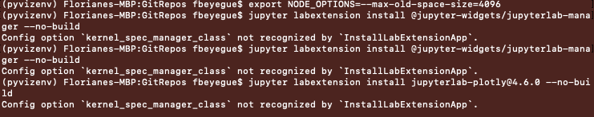

# Pyviz Setup Guide

This directory contains instructions for setting up Pyviz.

## Troubleshooting Tips

### Warning: kernel_spec_manager_class

The following warning involving ```kernel_spec_manager_class``` may occur during the ```jupyter labextension install``` steps. This is a warning and not an error.


